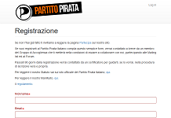

---
format: Markdown
title: Il Partito Pirata Italiano
toc: yes
categories: pp-it
...

# Come si diventa Pirata
Per iscriversi al Partito Pirata Italiano occorre prima di tutto prendere visione dello [Statuto](http://www.partito-pirata.it/partito/statuto/), il [Manifesto](http://www.partito-pirata.it/manifesto/) e il [Regolamento](http://www.partito-pirata.it/partito/regolamento/), verificare la propria aderenza ai principî ivi esposti, e compilare la [form di iscrizione](https://iscrizione.partito-pirata.it).

# Come funziona il Partito Pirata Italiano
Dal punto di vista legislativo il Partito Pirata è una associazione non riconosciuta, il cui funzionamento è regolato dallo [Statuto](http://www.partito-pirata.it/statuto/). Per poter funzionare correttamente, la "macchina partito" necessita dell'apporto di tutti i suoi membri.

Seguono le pagine che descrivono come funziona tale _macchina_, come farne parte, e come interagire con essa:

 * [Organi e incarichi]() nel Partito Pirata
